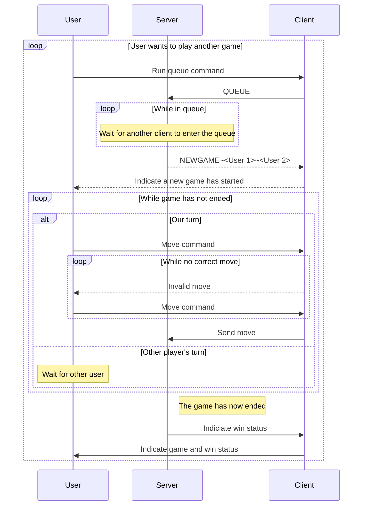

```mermaid
sequenceDiagram
    loop User wants to play another game
        participant User
        participant Server
        participant Client
        User->>Client:Run queue command
        Client->>Server:QUEUE
        loop While in queue
            Note over Server:Wait for another client to enter the queue
        end
        Server-->>Client:NEWGAME~<User 1>~<User 2>
        Client-->>User:Indicate a new game has started
        loop While game has not ended
            alt Our turn
                User->>Client:Move command
                loop While no correct move
                    Client-->>User:Invalid move
                    User->>Client:Move command
                end
                Client->>Server:Send move
            else Other player's turn
                note over User:Wait for other user
            end
        end
        note right of Server:The game has now ended
        Server->>Client:Indiciate win status
        Client->>User:Indicate game and win status
    end
```
