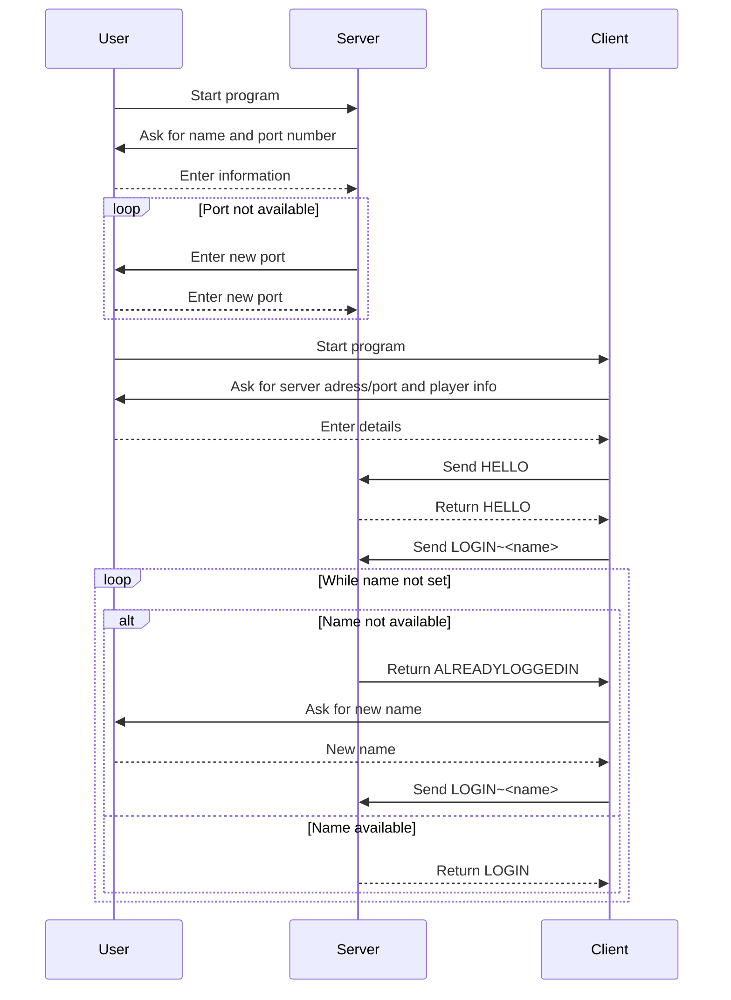

```mermaid
sequenceDiagram
    User->>Server:Start program
    Server->>User:Ask for name and port number
    User-->>Server:Enter information
    loop Port not available
        Server->>User:Enter new port
    User-->>Server:Enter new port
    end
    User->>Client:Start program
    Client->>User:Ask for server adress/port and player info
    User-->>Client:Enter details
    Client->>Server:Send HELLO
    Server-->>Client:Return HELLO
    Client->>Server:Send LOGIN~<name>
    loop While name not set
        alt Name not available
            Server->>Client:Return ALREADYLOGGEDIN
            Client->>User:Ask for new name
            User-->>Client:New name
            Client->>Server:Send LOGIN~<name>
        else Name available
            Server-->>Client:Return LOGIN
        end
    end
```
